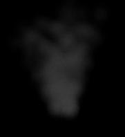
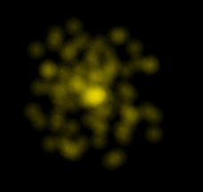
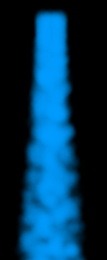

# ParticleSystem (June 2014)

Implemented in C++ with SFML. Rebuilt in August 2019 with SFML 2.5.1. If the app does not run, make sure you have vcredist_x86 installed.

Three types of Particle Systems: Smoke, Spark and Water.

## Project Description
The project is a showcase of three types of particle systems:
* Smoke: Gray particles slowly rise to the top

* Sparks: Circular emitting particles similar to spark of electricity

* Water: Blue particles rapidly fall down to simulate waterfall

